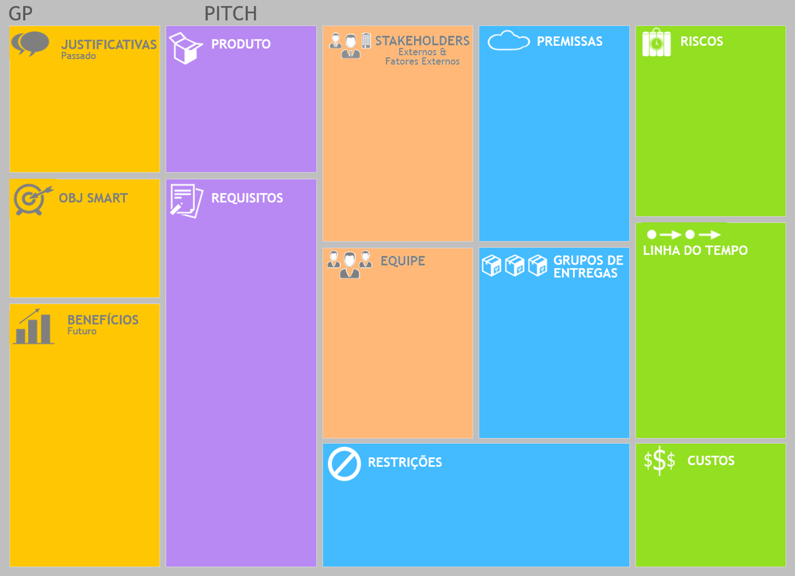

# Sprint Pitch

## Por Que?

### Justificativa:
 - Preços abusivos direto com os fornecedores;
 - Diversos meios de venda dificultando a busca por melhores preços;
 - Desentralização dos jogos, devido os diferentes produtores e fornecedores.

### Objetivo smart:
 - centralizar os forncedores de jogos;
 - Fornecer as melhores promoções e descontos; 
 - Promover praticidade na aquisição dos jogos;

### Benefícios:
 - Divugação da plataforma em propagandas do meio;
 - parcerias comerciais com os grandes playes de fornecimento de jogos;
 - melhor experiencia e satisfação para o cliente;
 - crescimento das ações da empresa;

## O quê?

### Produto
 - Uma plataforma de venda de jogos digitais.

### Requisitos
 - deve ter promoções;
 - deve ter centralização dos jogos independente dos fornecedores;
 - deve ter descontos;
 - deve ter desenvolvimento orientado a hipotestes.

## Quem?

### Stakeholders
 - 3 Integrantes do corpo docente do curso DSM.

### Equipe
 - 1- Scrum Master;
 - 1- Design Gráfico;
 - 3- Desenvolvedores.

## Como ?

### Premissas
 - 89,9% dos levantamentos de engenharia de software entregue, em 8 de junho de 2021;
 - Apresentação de 4 mockups funcionais, em 12 de junho de 2021;
 - Hospedagem da plataforma em 12 de agosto de 2021;
 - Divulgação do MVP, em 16 de setembro de 2021.

### Grupos de entrega
- Planejamento;
- Levantamento de requisitos;
- Prototipação;
- Desenvolvimento;
- Implantação.

### Restrições
 - A equipe dedica-se apenas 12 horas semanais no projeto;
 - Contato com os Stackholders ocorrem 1 vez por semana;
 - Os recursos tecnologicos deverão ser open source.

## Quando e Quanto?

### Riscos
 - Baixa adesão do uso da plataforma;
 - Responsividade para os dispositivos mobile;
 - Não cumprimento dos prazos definidos;
 - Curva de aprendizado do time as regras de negócio.

### Linha do tempo
1. Planejamento e Levantamento de requisitos Jun/2021; 
2. Prototipação e Aprovação Jun/2021;
3. Desenvolvimento e Testes - Jun/2021;
4. Implantação e Suporte  - Jul/2021.

### Custos
- Planejamento R$13.965,00;
- Levantamento de requisitos R$13.965,00;
- Prototipação R$8.300,00;
- Desenvolvimento R$12.647,50;
- Implantação R$12.647,50.